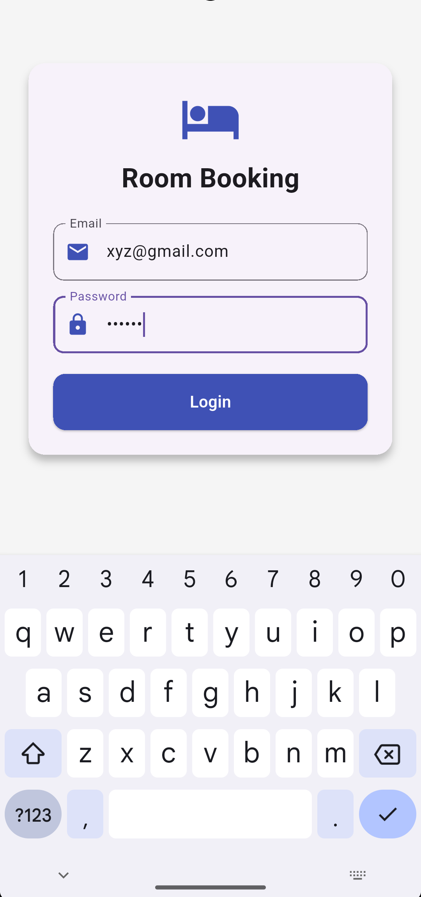
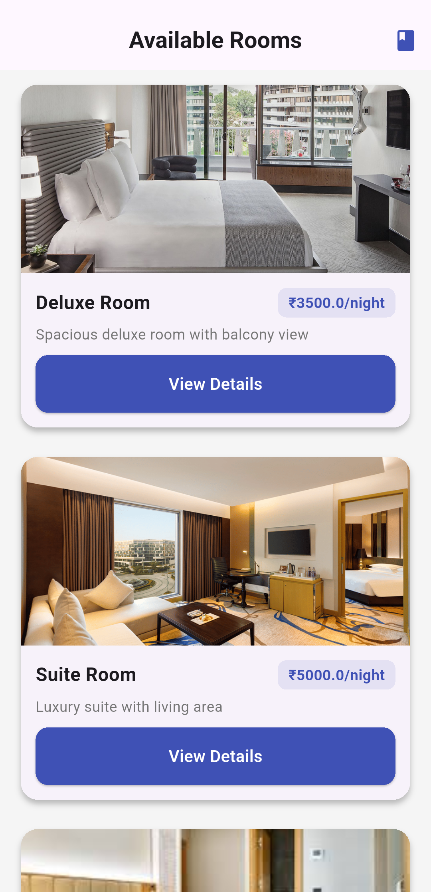
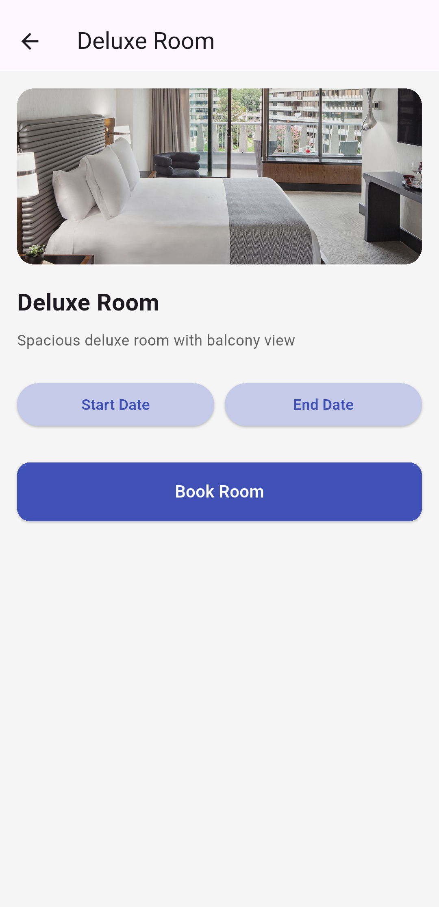
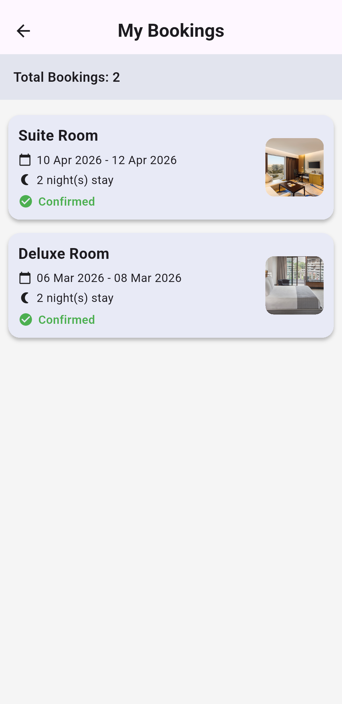

# room_booking_app

This project is a Flutter-based mobile application that allows users to browse rooms, check availability, and make bookings.

The application was developed as part of a technical assignment to demonstrate Flutter fundamentals, state management, UI design, and local data handling.

---

## Features

- Mock login screen
- Dashboard displaying available rooms
- Room details with description and image
- Date selection for booking
- Room availability validation
- Booking confirmation
- My Bookings screen
- Local persistence using SharedPreferences
- Responsive UI
- Error handling and empty states

---

## Tech Stack

- Flutter (latest stable)
- Dart
- Provider (State Management)
- SharedPreferences (Local storage)
- Intl (Date formatting)

---

## App Screens

1. Login Screen  
2. Dashboard (Room Listing)  
3. Room Detail Screen  
4. Booking Flow  
5. My Bookings Screen  

---

## Folder Structure

---

Room Booking App/

  lib
 ├── models
 │   ├── room_model.dart
 │   └── booking_model.dart
 │
 ├── providers
 │   ├── auth_provider.dart
 │   ├── room_provider.dart
 │   └── booking_provider.dart
 │
 ├── screens
 │   ├── login_screen.dart
 │   ├── dashboard_screen.dart
 │   ├── room_detail_screen.dart
 │   └── my_bookings_screen.dart
 │
 ├── widgets
 │   ├── room_card.dart
 │   ├── booking_card.dart
 │   └── primary_button.dart
 │
 ├── utils
 │   └── helpers.dart
 │
 └── main.dart

---

## Setup Instructions

### 1. Clone the repository

git clone https://github.com/priyankanit/room-booking-app.git

### 2. Navigate to project

cd flutter-room-booking-app

### 3. Install dependencies

flutter pub get

### 4. Run the app

flutter run

## Screenshots

 # Login screen

 

 # Dashboard

 

 # Room details

 

 # My bookings

 

---

## Author

Priyanka Gautam